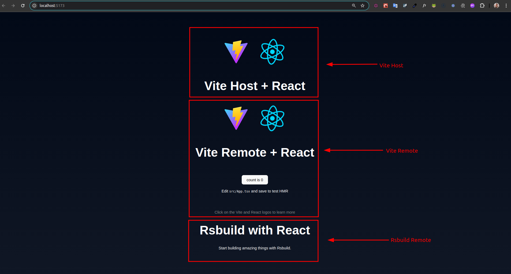

# Sample Federation Monorepo



This repository demonstrates the use of **Module Federation** to share modules between two applications built with different bundlers: **Vite** and **rsbuild**. The goal is to show how these two tools can work together in a micro frontends configuration.

## Repository Structure

- **packages/host-vite**: Host application using Vite.
- **packages/rsbuild-remote**: Remote application using rsbuild.
- **packages/vite-remote**: Remote application using Vite.

## Prerequisites

- **Node.js**: >= 20.x

## Installation

### Step 1: Clone the Repository

Clone the repository to your local machine:

```bash
git clone https://github.com/DevJoaoLopes/sample-federation-monorepo.git
cd sample-federation-monorepo
```


### Step 2: Install Dependencies
Install the dependencies for all packages:

```bash
yarn install
```

This will install all the required dependencies for the Vite application, rsbuild application, and shared modules.

### Step 3: Run the Applications
Now, in two separate terminal windows, start the applications:

```bash
yarn start
```

### Step 4: Access the Applications
App Host Vite:  http://localhost:5173/


1. Vite Configuration (packages/host-vite)
In the vite.config.ts file, the Module Federation is configured as follows:

```ts
export default defineConfig({
  plugins: [react(), federation({
    name: 'vitehost',
    filename: 'remoteEntry.js',
    remotes: {
      viteRemote:{
        name: 'viteRemote',
        type: 'module',
        entry: 'http://localhost:4001/remoteEntry.js',
      },
      rsbuildRemote:{
        name: 'rsbuildRemote',
        entry: 'http://localhost:4002/remoteEntry.js',
      }
    },
    shared: {
      react: {
        requiredVersion: "18.3.1",
        singleton: true,
      },
      "react-dom": {
        requiredVersion: "18.3.1",
        singleton: true,
      },
    },
  }
  )],
  build: {
    target: "chrome89",
  }
})
```

2. rsbuild Configuration (packages/rsbuild-remote)
The Module Federation configuration in rsbuild is defined in the rsbuild.config.ts file:

```ts
export default defineConfig({
  plugins: [pluginReact()],
  server: {
    port: 4002
  },
  moduleFederation: {
    options: {
      name: 'rsbuildRemote',
      filename: 'remoteEntry.js',
      exposes: {
        './App': './src/App',
      },
      shared: {
        react: {
          requiredVersion: '18.3.1',
          singleton: true,
        },
        'react-dom': {
          requiredVersion: '18.3.1',
          singleton: true,
        },
      },
    }
  },
});
```
3. Vite Remote App Configuration (packages/vite-remote)
In the vite.config.ts file, the Module Federation is configured as follows:


```ts
export default defineConfig({
  plugins: [react(),
    federation({
      name: 'viteRemote',
      filename: 'remoteEntry.js',
      exposes: {
        "./App": "./src/App",
      },
      shared: {
        react: {
          requiredVersion: "18.3.1",
          singleton: true,
        },
        "react-dom": {
          requiredVersion: "18.3.1",
          singleton: true,
        },
      },
    }),
  ],
  server: {
    port: 4001,
  },
  build: {
    target: "chrome89",
  }
})

```


## Conclusion
This example shows how to use Module Federation in applications built with Vite and rsbuild. It allows for components from one application to be shared with another, facilitating the creation of Micro Frontends and enabling greater modularity.

## Final Considerations
Module Federation configuration allows sharing and consuming modules efficiently between applications that use different bundlers.
Make sure that shared dependencies are compatible across applications to avoid version conflicts and issues.
For more information or help with the setup, check out the official documentation for Module Federation.


